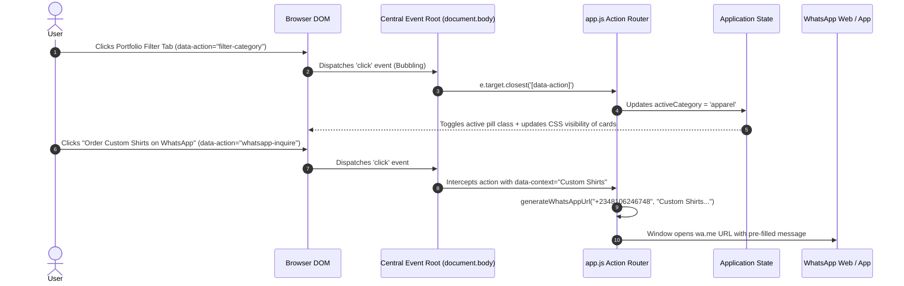

# Architecture Spine: MJr Designs & Print Solutions

## 1. Executive Architecture Summary

* **Design Paradigm**: **Modular Vanilla Web Architecture (Native-First)**
* **Core Philosophy**: Zero external runtime dependencies. The browser provides a rich, modern, and performant platform for single-page applications when standard APIs (Semantic HTML5, CSS3 Custom Properties, CSS Grid/Flexbox, ES6+ DOM & Event APIs) are composed cleanly.
* **Dual Purpose**:
  1. **Commercial**: Sub-second paint time, 100 Lighthouse performance, frictionless contextual lead routing to WhatsApp (`+2348106246748`).
  2. **Pedagogical**: Direct code transparency that teaches core frontend engineering principles without framework abstraction layers.

---

## 2. Invariants & Architectural Decisions (ADs)

### AD-1: Pure Vanilla Web Standards (Zero-Framework Invariant)
* **Binds**: All client-side runtime logic, markup, and styling to standard native browser capabilities.
* **Prevents**: Framework bloat, bundler build friction (Webpack/Vite/Babel), hydration mismatches, and abstraction-induced learning gaps.
* **Rule**:
  ```text
  No runtime npm packages, no CSS preprocessors, and no JS libraries (React, Vue, jQuery, Tailwind, Bootstrap) are permitted in production code. The build requires 0 compilation steps to execute in any modern evergreen browser.
  ```

---

### AD-2: Unidirectional State-Driven Portfolio Rendering
* **Binds**: The portfolio state and category filtering to a single immutable dataset in `app.js`.
* **Prevents**: DOM-scraping bugs, out-of-sync filter counts, and inconsistent modal data representations.
* **Rule**:
  ```text
  PORTFOLIO_DATA serves as the single source of truth. UI filtering modifies an internal state object (currentState = { activeCategory: 'all', activeModalId: null }) which dispatches DOM class updates and aria-selected state changes.
  ```

---

### AD-3: Centralized Event Delegation Root
* **Binds**: All user interactive events (clicks, category filtering, modal toggles, mobile drawer triggers) to a single top-level event listener.
* **Prevents**: Memory leaks from repetitive event listener attachments, lost handlers on dynamically re-rendered nodes, and scattered event logic.
* **Rule**:
  ```text
  All interactive triggers must declare data-action and relevant metadata attributes (data-category, data-project-id, data-service). A centralized document.addEventListener('click', ...) reads e.target.closest('[data-action]') and delegates to dedicated action handlers.
  ```

---

### AD-4: Tokenized CSS Architecture (3-Tier Custom Properties)
* **Binds**: All layout dimensions, colors, typography scales, spacing, and transitions to `:root` CSS custom properties in `styles.css`.
* **Prevents**: Hardcoded magic numbers, inconsistent color codes, and fragmented breakpoint overrides.
* **Rule**:
  ```text
  Styles must strictly consume design tokens:
  - Color Tokens: --color-primary (#FF6B00), --color-primary-dark (#E05A00), --color-charcoal (#1A1A1A), --color-surface (#FFFFFF), --color-bg (#F8F9FA), --color-text-muted (#666666).
  - Spacing Tokens: --space-xs (4px) to --space-3xl (64px).
  - Layout Rules: 1-dimensional elements must use CSS Flexbox; 2-dimensional galleries must use CSS Grid with auto-fit/minmax.
  ```

---

### AD-5: Context-Aware Dynamic WhatsApp Lead Engine
* **Binds**: WhatsApp conversion links to a centralized URL constructor in `app.js`.
* **Prevents**: Broken deep links, hardcoded phone discrepancies, and un-personalized general contact messages.
* **Rule**:
  ```text
  All WhatsApp conversion triggers execute through generateWhatsAppUrl(phone, contextString), producing an encoded https://wa.me/2348106246748?text=... URI containing the exact service, project name, or section the user was browsing.
  ```

---

### AD-6: Accessible Modal & Lightbox Contract
* **Binds**: Project inspection overlays to native accessible dialog patterns.
* **Prevents**: Focus traps, background scroll bleeding, and accessibility (A11y) violations for screen-reader and keyboard users.
* **Rule**:
  ```text
  The lightbox modal must implement aria-modal="true", role="dialog", focus trapping, document body scroll-locking (overflow: hidden), and close on both Escape keydown and backdrop overlay click.
  ```

---

## 3. System Topology & File Tree Seed

```text
mjr/
├── index.html                  # Single-page semantic HTML5 structure & landmarks
├── styles.css                  # Production CSS3 (Tokens, Reset, Layouts, Components, Media Queries)
├── app.js                      # Modern ES6+ JavaScript (State, Event Delegation, Filter, Modal, WhatsApp)
├── assets/
│   ├── images/
│   │   ├── logo/
│   │   │   └── mjr-logo.svg    # High-res SVG brand logo
│   │   ├── portfolio/          # Extracted & optimized case study mockups
│   │   │   ├── cyma-homes.jpg
│   │   │   ├── glazing-memoirs.jpg
│   │   │   ├── oab-foundation.jpg
│   │   │   ├── tolw-mag.jpg
│   │   │   ├── streetwear-merch.jpg
│   │   │   └── skillforge-billboard.jpg
│   │   └── clients/            # Verified client logos
│   │       ├── cyma.png
│   │       ├── tmh.png
│   │       ├── ppfn.png
│   │       └── tolw.png
└── _bmad-output/               # Project governance & planning artifacts
```

---

## 4. Component Interaction & Event Delegation Flow



---

## 5. Pedagogical Masterclass Roadmap (Frontend Fundamentals)

The implementation is mapped to distinct foundational learning modules:

| Module | Core Concepts Taught | Artifact / Code Location |
| :--- | :--- | :--- |
| **Module 1: Semantic DOM & Accessibility** | HTML5 landmarks (`<header>`, `<nav>`, `<main>`, `<section>`, `<footer>`), heading hierarchy (`<h1>`-`<h3>`), ARIA attributes (`aria-expanded`, `aria-selected`), accessible button primitives. | `index.html` |
| **Module 2: CSS Layout & Design Tokens** | CSS Custom Properties (`:root`), fluid typography (`clamp()`), the CSS Box Model, CSS Flexbox (1D alignment & distribution), CSS Grid (2D responsive auto-fit grids). | `styles.css` |
| **Module 3: Event Delegation & DOM APIs** | The DOM Event Bubbling phase, `addEventListener` performance, `event.target.closest()`, data attribute APIs (`dataset`), and clean separation of concerns. | `app.js` (Event Engine) |
| **Module 4: Vanilla State Management** | Data modeling with immutable JavaScript objects, state-to-UI synchronization, responsive modal controllers with focus trapping. | `app.js` (State & Modal) |
| **Module 5: Mobile Responsive Engineering** | Responsive media queries, hamburger drawer animation, fluid touch targets (\(\ge 48\text{px}\)), and zero-layout-shift image loading (`loading="lazy"`). | `styles.css` & `app.js` |

---

## 6. Deferred Items (Out of Scope for v1)

1. **Subdomain E-Commerce (`streetwear.mjr.com`)**: Standalone shopping cart, payment gateway integration, and 3D product customizer.
2. **Backend Server / CMS**: Static deployment with client-side state is chosen for maximum speed, security, and simplicity.
