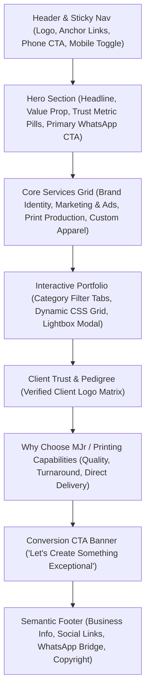

# Product Requirements Document (PRD)
## MJr Designs & Print Solutions Limited

---

## 1. Executive Summary & Product Vision

**MJr Designs & Print Solutions Limited** is a premier creative design and commercial print production enterprise providing corporate businesses, public institutions, and retail brands with high-impact brand identity systems, large-scale publication printing, advertising campaigns, and custom apparel manufacturing.

This project specifies the design, functional requirements, and technical architecture of a high-converting, single-page commercial website built with **100% pure vanilla web standards** (HTML5, modern CSS3, and ES6+ JavaScript). The product fulfills two strategic directives:
1. **Commercial Conversion Hub**: An authoritative digital storefront that elevates the brand above local print shops, displays validated client case studies (CYMA Homes, Glazing Memoirs, OAB Foundation, Tour of Lagos Waterways, Custom Streetwear), and funnels high-intent corporate and retail inquiries into customized WhatsApp conversations (`+2348106246748`).
2. **Pedagogical Masterclass**: A clean, modular, production-ready codebase engineered to teach core frontend fundamentals—including semantic DOM structure, CSS layout algorithms (Flexbox for 1D, CSS Grid for 2D), design token architecture, accessibility (WCAG 2.1 AA), and robust JavaScript event delegation with zero runtime libraries.

---

## 2. Target Protagonists & Canonical User Journeys

### UJ-1: Tunde — Managing Director at a Real Estate Firm (Corporate Buyer)
* **Goal**: Procure a complete corporate identity package (hard hats, branded shirts, stationery, luxury brochures) for an upcoming estate launch.
* **Journey**:
  1. Lands on the homepage via a referral link on mobile.
  2. Absorbs the hero value proposition and scans the corporate service pillars.
  3. Navigates to the Portfolio section, selects the **"Brand Identity"** category filter, and spots the **CYMA Homes** case study.
  4. Clicks the card to open the accessible **Lightbox Modal** to inspect mockups.
  5. Clicks the contextual **"Inquire via WhatsApp"** button inside the modal.
  6. WhatsApp launches with a pre-populated inquiry tailored specifically to Corporate Identity and CYMA Homes.

### UJ-2: Amaka — Creative Director of an Urban Streetwear Label (Apparel Retailer)
* **Goal**: Source an experienced print partner for 300+ custom-designed heavyweight t-shirts and branded caps for a new fashion collection.
* **Journey**:
  1. Lands on the website via an Instagram link.
  2. Clicks the **"Custom Apparel & Merch"** filter tab in the Portfolio gallery.
  3. The gallery instantly transitions to show apparel mockups, caps, and merchandise samples.
  4. Clicks **"Order Custom Shirts on WhatsApp"** on the featured apparel card.
  5. WhatsApp opens with an apparel-specific inquiry template ready to send.

### UJ-3: Dr. Sola — Head of Public Relations for an NGO (Editorial & Event Organizer)
* **Goal**: Commission 500 annual report compendiums, event backdrops, and outdoor banners for a national health initiative.
* **Journey**:
  1. Opens the site on a desktop browser.
  2. Validates credibility via the **Client Trust Matrix** (spotting PPFN, The Minaret Hospital, Tour of Lagos Waterways).
  3. Inspects the **"Publications & Editorial"** case study carousel.
  4. Taps **"Request Publication Print Quote"**, engaging MJr directly on WhatsApp with project parameters.

---

## 3. Information Architecture & Section Hierarchy

The single-page website is organized into a cohesive, top-to-bottom narrative flow:



---

## 4. Functional Requirements

### 4.1. Navigation & Global Layout (FR-100 Series)

* **FR-101 (Semantic Navigation)**: The system shall provide a semantic `<header>` element containing a sticky navigation bar with the MJr brand logo, desktop anchor links (`#services`, `#portfolio`, `#about`, `#contact`), and a high-visibility WhatsApp quick-action button.
* **FR-102 (Mobile Responsive Drawer)**: On viewport widths below `768px`, the desktop navigation links shall collapse into an accessible hamburger menu toggle (`aria-expanded="false"` / `"true"`), opening a full-screen or slide-out drawer.
* **FR-103 (Smooth Scrolling & Active Spy)**: Clicking any navigation link shall smoothly scroll the viewport to the corresponding section anchor without jarring page jumps.

---

### 4.2. Hero & Value Proposition (FR-200 Series)

* **FR-201 (Hero Headline & Copy)**: The hero section shall render the primary brand tagline: *"Creative Design. Strategic Branding. Quality Print."* and a clear supporting value proposition.
* **FR-202 (Proof Metrics / Trust Pills)**: The hero shall render trust-building badges (e.g. *"100+ Completed Projects"*, *"Corporate & Event Specialists"*, *"Nationwide Delivery"*).
* **FR-203 (Primary Direct Action CTA)**: The hero shall feature a prominent, high-contrast button triggering the dynamic WhatsApp conversation engine with general inquiry parameters.

---

### 4.3. Core Service Pillars (FR-300 Series)

* **FR-301 (Service Pillar Grid)**: The system shall render a 4-pillar responsive card grid covering:
  1. **Brand Identity & Corporate Design** *(Logo systems, brand books, stationery, corporate profiles)*
  2. **Marketing & Advertising Design** *(Billboards, social media creatives, digital campaign ads)*
  3. **Print & Publication Production** *(Magazines, annual compendiums, brochures, catalogues, calendars)*
  4. **Event & Environmental Branding** *(Custom shirts, branded merchandise, exhibition booths, stage backdrops)*
* **FR-302 (Service Contextual Triggers)**: Each service card shall contain a contextual *"Inquire for [Service Name]"* button that passes its service identifier to the dynamic WhatsApp generator.

---

### 4.4. Interactive Portfolio Showcase (FR-400 Series)

* **FR-401 (Category Filter Bar)**: The portfolio section shall display an accessible pill-tab filter bar with options:
  * `All Projects`
  * `Brand Identity`
  * `Publications & Editorial`
  * `Marketing & Billboards`
  * `Custom Apparel & Merch`
* **FR-402 (Zero-Framework DOM Filter Engine)**: Clicking any filter tab shall update the active tab state (`aria-selected="true"`) and instantaneously filter the portfolio card grid based on each card's `data-category` attribute using CSS opacity and transform transitions.
* **FR-403 (Portfolio Card Structure)**: Each portfolio card shall render:
  * High-quality mockup image thumbnail with `loading="lazy"` and descriptive `alt` text.
  * Category badge pill.
  * Project title (e.g., *CYMA Homes Limited*, *Glazing Memoirs*, *Tour of Lagos Waterways*).
  * Scope tag list (e.g., *#LogoDesign*, *#Stationery*, *#ApparelPrint*).
  * Expand button to trigger the Lightbox inspection modal.
* **FR-404 (Accessible Lightbox Modal)**: Clicking a portfolio card shall open a modal (`<dialog>` or accessible overlay) displaying:
  * Full-resolution project mockup image.
  * Extended project brief and deliverable scope.
  * Direct *"Request a Similar Quote on WhatsApp"* action button.
* **FR-405 (Keyboard & Focus Management)**: The modal shall close upon pressing the `Escape` key or clicking the backdrop overlay, and shall trap keyboard focus while open.

---

### 4.5. Dynamic Context-Aware WhatsApp Conversion Engine (FR-500 Series)

* **FR-501 (Centralized Link Generator)**: The JavaScript engine (`app.js`) shall construct sanitized WhatsApp URLs to phone number `+2348106246748`.
* **FR-502 (Contextual Message Templates)**: The engine shall dynamically populate message copy based on source metadata:
  * **General Hero**: *"Hello MJr Designs, I'd like to discuss a custom design and print project."*
  * **Brand Identity**: *"Hello MJr Designs, I am interested in your Brand Identity & Corporate Design packages."*
  * **Publications**: *"Hello MJr Designs, I would like to request a quote for Magazine / Publication printing."*
  * **Custom Apparel**: *"Hello MJr Designs, I am looking for custom shirt and apparel printing for my brand/organization."*
  * **Specific Project (e.g. CYMA)**: *"Hello MJr Designs, I saw your CYMA Homes case study and would like to discuss a similar project."*

---

### 4.6. Client Trust Matrix & Footer (FR-600 Series)

* **FR-601 (Client Logo Matrix)**: The system shall display verified client brand names and logos extracted from the portfolio (CYMA, TMH, PPFN, TOLW, GoWeld, KiiB, Duromoney, etc.).
* **FR-602 (Semantic Footer)**: The footer shall provide contact details (Phone/WhatsApp `+2348106246748`, Email `mjrgdesigns@gmail.com`), operating hours, quick links, and copyright notices.

---

## 5. Non-Functional & Pedagogical Engineering Requirements

| ID | Category | Specification |
| :--- | :--- | :--- |
| **NFR-101** | **Zero Frameworks** | The application shall strictly use Vanilla HTML5, modern CSS3, and ES6+ JavaScript. Zero external NPM runtime libraries, zero CSS frameworks (no Tailwind, Bootstrap), zero JS libraries (no React, jQuery). |
| **NFR-102** | **Event Delegation** | All user interactions (filtering, modal opening, mobile nav toggle, CTA dispatch) shall be handled via centralized event listeners on container nodes using `e.target.closest('[data-action]')`. |
| **NFR-103** | **CSS Design Tokens** | All visual styles (palette colors, typography scales via `clamp()`, spacing units, border radii, shadows) shall be declared as CSS Custom Properties in `:root` inside a single `styles.css`. |
| **NFR-104** | **Layout Algorithms** | 1-dimensional components (navbar, filter pills, flex badges) shall use Flexbox. 2-dimensional components (portfolio grid, client logo matrix) shall use CSS Grid with `repeat(auto-fit, minmax(...))`. |
| **NFR-105** | **Performance** | The site shall achieve \(\ge 95\) on Google Lighthouse Performance audits, with a First Contentful Paint (FCP) \(< 1.0\text{s}\) on standard 4G connections. |
| **NFR-106** | **Accessibility** | The site shall conform to WCAG 2.1 AA standards, ensuring full keyboard navigability, high color contrast ratios, and valid ARIA attributes (`aria-expanded`, `aria-selected`, `aria-modal`). |
| **NFR-107** | **Browser Support** | Full cross-browser compatibility across modern evergreen browsers (Chrome, Edge, Safari, Firefox, iOS Safari, Android Chrome). |

---

## 6. Client-Side Data Model Schema

The portfolio items shall be modeled as a clean, immutable JavaScript data array in `app.js` to demonstrate state-driven UI rendering:

```javascript
const PORTFOLIO_DATA = [
  {
    id: "cyma-homes",
    title: "CYMA HOMES Limited",
    category: "branding",
    categoryLabel: "Brand Identity & Corporate Design",
    thumbnail: "assets/images/portfolio/cyma-preview.jpg",
    fullImage: "assets/images/portfolio/cyma-full.jpg",
    scope: ["Logo Design", "Brand Assets", "Stationery", "Hard Hats", "Vehicle Branding"],
    description: "Full-scale corporate identity and safety gear branding for a premier real estate firm.",
    whatsappContext: "CYMA Homes Corporate Branding"
  },
  {
    id: "streetwear-merch",
    title: "Custom Branded Shirts & Streetwear",
    category: "apparel",
    categoryLabel: "Custom Apparel & Merch",
    thumbnail: "assets/images/portfolio/apparel-preview.jpg",
    fullImage: "assets/images/portfolio/apparel-full.jpg",
    scope: ["Custom T-Shirts", "Trucker Caps", "Screen & Heatpress Printing", "Label Tags"],
    description: "Premium heavy-cotton customized t-shirts and fashion apparel manufacturing for retail and corporate clients.",
    whatsappContext: "Custom Shirt & Apparel Printing"
  },
  {
    id: "glazing-memoirs",
    title: "Glazing Memoirs",
    category: "branding",
    categoryLabel: "Packaging & Brand Identity",
    thumbnail: "assets/images/portfolio/glazing-preview.jpg",
    fullImage: "assets/images/portfolio/glazing-full.jpg",
    scope: ["Logo Design", "Yoghurt Bottles", "Food Packaging", "Takeaway Bags"],
    description: "Vibrant brand identity and product packaging design for an FMCG food and catering company.",
    whatsappContext: "Glazing Memoirs Product Packaging"
  },
  {
    id: "tolw-brochure",
    title: "Tour of Lagos Waterways (TOLW)",
    category: "publications",
    categoryLabel: "Publications & Editorial",
    thumbnail: "assets/images/portfolio/tolw-preview.jpg",
    fullImage: "assets/images/portfolio/tolw-full.jpg",
    scope: ["Brochure Design", "5th Edition Magazine", "Editorial Layout", "Outdoor Billboards"],
    description: "High-volume official event publication and marine tourism editorial brochure.",
    whatsappContext: "Tour of Lagos Waterways Publications"
  },
  {
    id: "skillforge-billboard",
    title: "SkillForge ICT Academy",
    category: "marketing",
    categoryLabel: "Marketing & Billboards",
    thumbnail: "assets/images/portfolio/skillforge-preview.jpg",
    fullImage: "assets/images/portfolio/skillforge-full.jpg",
    scope: ["Large Format Billboard", "Digital Campaigns", "Outdoor Ad"],
    description: "High-impact outdoor billboard design and tech career campaign advertising.",
    whatsappContext: "SkillForge Large Format Billboard"
  }
];
```

---

## 7. Scope Boundaries

### In Scope (v1 Production Single-Page Site)
* Complete semantic HTML5 page structure (`index.html`).
* Production CSS3 design system (`styles.css`) with tokens, responsive grid/flexbox layouts, and fluid typography.
* Modular Vanilla JavaScript (`app.js`) with DOM event delegation, dynamic portfolio filtering, modal viewer, and WhatsApp intent query generator.
* Extracted authentic brand assets and case studies from `mjr portfolio.pdf`.

### Explicitly Out of Scope (v2 Roadmap)
* Full e-commerce shopping cart and online payment gateway.
* Dedicated `streetwear.mjr.com` 3D apparel customizer (parked for phase 2).
* Database backends or server-side rendering pipelines.

---

## 8. Success Metrics & Quality Gates

* **Zero-Defect Accessibility**: All interactive elements operable via keyboard navigation.
* **Lead Conversion Velocity**: Target under 5 seconds from landing on a portfolio case study to opening a pre-filled WhatsApp conversation.
* **Performance Gate**: \(\ge 95\) rating on Lighthouse audits (Performance, Accessibility, Best Practices, SEO).
